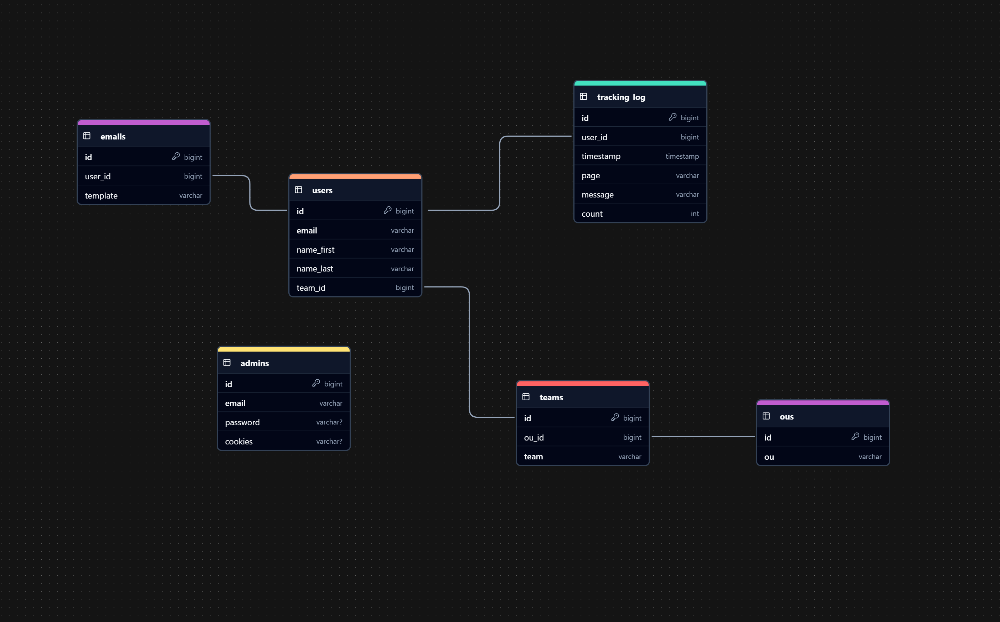

# **Phisher**

_This is totally not a phishing simulator that sends phishing emails to chosen people and and tracks if those idiots fell for it._

## **Table of Contents**

1. [Features](#features)
2. [Installation](#installation)
3. [Database Schema](#database-schema)
4. [Routes Schema](#routes-schema)
5. [Run and Test](#run-and-test)
6. [Technologies Used](#technologies-used)

---

## **Features**

- Only administrators have access!
- Send emails to employes and track their behaviour!
- Choose one out of multiple templates to send!
- Access to a log of all the actions!

## **Installation**

1. Clone the repository:

   ```cmd
   git clone https://github.com/TotallyNotAPhishingSimulator/Phisher.git
   cd Phisher
   ```

2. Install dependencies:

   ```cmd
   npm install
   ```

3. Set up environment variables and fill it out.

   ```cmd
   copy env.template .env
   ```

4. Set up the database.

   ```cmd
   npm run migrate
   ```

## **Database Schema**



## **Routes Schema**


## **Run and Test**

- **Start the Express server:**

  ```cmd
  npm run start
  ```

- **Run Jest tests:**

  ```cmd
  npm run test
  ```

## **Technologies Used**

- **Typescript / Javascript** – Language
- **Bootstrap** – CSS
- **Express.js** – Backend server
- **Node.js** – Javascript runtime
- **PostgreSQL** – Database
- **Nodemailer.js** - Emails
- **Bcrypt / Cookie-Parser / Jsonwebtoken / Password-Validator** - Authentication
- **Jest / Supertest** - Testing
